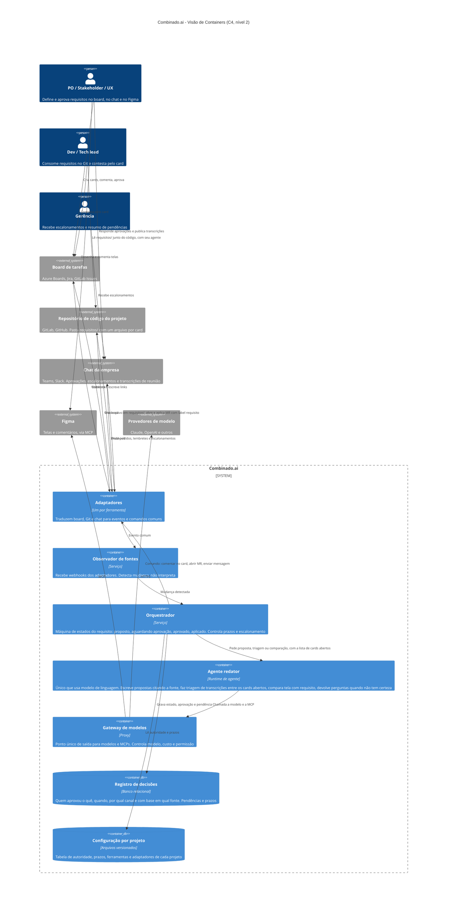

# Combinado.ai

Requisitos versionados e aprovados como código, sem tirar ninguém da ferramenta que já usa.

Este repositório é a fase de discovery de documentação (diagrams as code) do sistema, feita na Unidade III do curso Projeto e Arquitetura de Software com Apoio de IA Generativa (AKCIT/UFG). Não há implementação. A ideia é que esta documentação sirva de contexto para agentes de desenvolvimento implementarem o sistema sem inventar decisões.

## 1. O problema

Em um time de desenvolvimento, o trabalho do dev deixa rastro sozinho: commit, merge request, teste, produção. O trabalho de quem define o que o sistema deve fazer não deixa esse rastro. O pedido nasce em reunião, muda em conversa, é anotado em um card e refinado em um documento. Essas fontes nem sempre dizem a mesma coisa, e ninguém é dono de mantê-las alinhadas.

O card diz uma coisa e a especificação diz outra. O que foi combinado em reunião não foi anotado. Uma decisão muda no meio do caminho e o dev descobre tarde. O testador valida um documento que já não é verdade. Quando alguém pergunta quem decidiu o quê e quando, a resposta depende da memória das pessoas.

Não é falta de método. Métodos como o Spec Kit mantêm a especificação consistente por dentro. O que falta é um elo entre a especificação e o lugar onde as pessoas realmente combinam as coisas: o board, o chat, o Figma e a reunião.

## 2. A proposta

O Combinado.ai é um colaborador de IA que trata o requisito como se fosse código. Ele acompanha o board, o repositório, o Figma e o canal de chat do projeto. Quando alguém define ou muda um requisito, ele escreve essa mudança em um arquivo Markdown versionado, abre uma proposta de alteração e pede aprovação para quem tem autoridade sobre aquele tipo de decisão. A aprovação acontece no canal da pessoa, por exemplo um comentário no card. O sistema registra quem aprovou, quando e com base em quê, e só então aplica a mudança.

O PO e o stakeholder continuam trabalhando onde já trabalham. O Git fica atrás deles, não na frente. O dev passa a consumir requisitos com histórico, versão e aprovação, do mesmo jeito que consome código. Pendência sem resposta tem prazo e escalona, com a mesma visibilidade que um card parado tem hoje.

Descrição completa, escrita para ser lida por um agente antes de qualquer código: [`docs/descricao-sistema.md`](docs/descricao-sistema.md). Perguntas de esclarecimento e respostas: [`docs/esclarecimento.md`](docs/esclarecimento.md). Decisões de arquitetura: [`docs/adr/`](docs/adr/).

## 3. Diagramas

Gerados com apoio de IA (Claude) a partir da descrição em linguagem natural, seguindo o roteiro da Unidade III: primeiro lacunas e perguntas, depois o diagrama, depois revisão com checklist. As suposições adotadas e os checklists estão em [`docs/diagramas/containers-revisao.md`](docs/diagramas/containers-revisao.md) e [`docs/diagramas/sequencia-revisao.md`](docs/diagramas/sequencia-revisao.md).

### 3.1 Estrutural: visão de containers (C4, nível 2)

Fonte: [`docs/diagramas/containers.mmd`](docs/diagramas/containers.mmd)



### 3.2 Comportamental: nascimento do requisito

Da reunião entre PO e stakeholder até o refinamento técnico. Cobre a triagem da transcrição entre os cards abertos, a confirmação do PO nos trechos incertos, a aprovação do stakeholder e a detecção de divergência entre a spec e o requisito.

Fonte: [`docs/diagramas/sequencia-1-nascimento-do-requisito.mmd`](docs/diagramas/sequencia-1-nascimento-do-requisito.mmd)

```mermaid
sequenceDiagram
    autonumber
    actor Stake as Stakeholder (usuário)
    actor PO as PO
    participant Chat as Chat da empresa
    participant Board as Board de tarefas
    participant Adapt as Adaptadores
    participant Orq as Orquestrador
    participant Red as Agente redator
    participant Gw as Gateway de modelos
    participant Git as Repositório de código (requisitos/)
    participant Reg as Registro de decisões
    actor Dev as Dev / Tech lead

    Note over Stake,PO: Reunião de levantamento. O PO cola a transcrição no canal do projeto.
    Note over Adapt,Orq: O Observador de fontes fica entre Adaptadores e Orquestrador. Foi omitido aqui para simplificar a leitura.
    PO->>Chat: Cola a transcrição da reunião
    Chat->>Adapt: Webhook: mensagem nova no canal do projeto
    Adapt->>Orq: Evento: transcrição recebida (projeto X)
    Orq->>Adapt: Pedir lista de cards abertos do projeto
    Adapt->>Board: Consulta cards abertos
    Board-->>Adapt: Cards 1234, 1235, 1240 (título e resumo)
    Orq->>Red: Triagem: transcrição + cards abertos
    Red->>Gw: Chamada ao modelo
    Gw-->>Red: Trechos atribuídos com confiança
    Red-->>Orq: Trecho A -> card 1234 (certo); trecho B -> card 1240 (provável); trecho C -> nenhum card

    Orq->>Adapt: Criar requisitos/1234-horas-extras.md com o trecho A e a fonte
    Adapt->>Git: Cria arquivo e abre MR "requisito: 1234"
    Orq->>Adapt: Comentar no card 1234 com o link do arquivo e do MR
    Adapt->>Board: Comentário no card 1234
    Orq->>Reg: Estado 1234: proposto, aguardando aprovação do stakeholder

    alt Trecho B: provável
        Orq->>Adapt: Perguntar ao PO no card 1240 se o trecho B é deste card
        Adapt->>Board: Comentário no card 1240
        PO->>Board: Confirma
        Board->>Adapt: Webhook: resposta do PO
        Adapt->>Orq: Evento: atribuição confirmada
        Orq->>Reg: Grava confirmação (PO, data, card)
    end

    alt Trecho C: sem card
        Orq->>Adapt: Perguntar ao PO no chat: pedido novo ou descarte?
        Adapt->>Chat: Mensagem ao PO com o trecho C
        PO->>Chat: Responde que é pedido novo
        Orq->>Adapt: Criar card e arquivo de requisito para o trecho C
        Orq->>Reg: Grava decisão do PO (pedido novo, data, canal)
    end

    Orq->>Adapt: Pedir ao stakeholder que confirme o requisito 1234
    Adapt->>Chat: Na reunião foi combinado X. Confirma?
    Stake->>Chat: Aprova
    Chat->>Adapt: Webhook: resposta do stakeholder
    Adapt->>Orq: Evento: aprovação
    Orq->>Reg: Grava aprovação (stakeholder, data, canal, trecho A como fonte)
    Orq->>Adapt: Aplicar MR
    Adapt->>Git: Merge em main
    Orq->>Reg: Estado 1234: aprovado e aplicado

    Note over PO,Dev: Refinamento de negócio. Devs quebram o card 1234 em subcards.
    Dev->>Board: Cria subcards 1234-front e 1234-back
    Board->>Adapt: Webhook: subcards criados
    Adapt->>Orq: Evento: subcards do 1234
    Orq->>Adapt: Escrever nos subcards o link do requisito 1234
    Adapt->>Board: Comentário nos subcards

    Note over Dev,Git: Refinamento técnico. A spec do Spec Kit referencia o requisito.
    Dev->>Git: Commit da spec 1234 em specs/
    Git->>Adapt: Webhook: spec alterada
    Adapt->>Orq: Evento: spec do 1234 mudou
    Orq->>Red: Comparar spec com requisito aprovado
    Red->>Gw: Chamada ao modelo
    Gw-->>Red: Divergência: spec diz formato decimal, requisito diz HH:MM
    Red-->>Orq: Divergência encontrada com trecho e linha
    Orq->>Adapt: Comentar no card 1234 e avisar o tech lead
    Adapt->>Board: Comentário com a divergência
    Orq->>Reg: Pendência: divergência spec x requisito, responsável tech lead
```

### 3.3 Comportamental: mudança com o carro andando

O card já está em implementação e chega um pedido tardio pelo chat ou uma mudança de tela no Figma. Cobre o caminho de sucesso e as duas falhas: quem aprova não responde no prazo, e pedido que não bate com nenhum card.

Fonte: [`docs/diagramas/sequencia-2-mudanca-com-o-carro-andando.mmd`](docs/diagramas/sequencia-2-mudanca-com-o-carro-andando.mmd)

```mermaid
sequenceDiagram
    autonumber
    actor Stake as Stakeholder (usuário)
    actor PO as PO
    actor Ger as Gerência
    participant Chat as Chat da empresa
    participant Figma as Figma (via MCP)
    participant Board as Board de tarefas
    participant Adapt as Adaptadores
    participant Orq as Orquestrador
    participant Red as Agente redator
    participant Gw as Gateway de modelos
    participant Git as Repositório de código (requisitos/)
    participant Reg as Registro de decisões
    actor Dev as Dev

    Note over Stake,Dev: O card 1234 já está em implementação. O requisito aprovado diz horas em HH:MM.
    Note over Adapt,Orq: O Observador de fontes fica entre Adaptadores e Orquestrador. Foi omitido aqui para simplificar a leitura.

    alt Pedido tardio no chat
        Stake->>Chat: A tela de horas precisa de uma coluna de saldo
        Chat->>Adapt: Webhook: mensagem no canal do projeto
        Adapt->>Orq: Evento: possível mudança de requisito
    else Mudança tardia no Figma
        Figma-->>Gw: MCP: tela do card 1234 alterada (coluna nova)
        Gw-->>Red: Notificação de mudança de tela
        Red-->>Orq: Evento: tela do 1234 diverge do requisito
    end

    Orq->>Adapt: Pedir lista de cards abertos do projeto
    Adapt->>Board: Consulta
    Board-->>Adapt: Cards abertos
    Orq->>Red: Identificar o card e propor a mudança
    Red->>Gw: Chamada ao modelo (e leitura da tela via MCP)
    Gw-->>Red: Card 1234; proposta: nova coluna de saldo; fonte: mensagem do stakeholder
    Red-->>Orq: Proposta de mudança no requisitos/1234-horas-extras.md

    alt Não bate com nenhum card aberto
        Orq->>Adapt: Perguntar ao PO: card novo ou descarte?
        Adapt->>Chat: Mensagem ao PO
        Note over Orq: Nada é criado nem aplicado até o PO responder.
    end

    Orq->>Adapt: Abrir MR "requisito: 1234" com a mudança e a fonte
    Adapt->>Git: Abre MR
    Orq->>Reg: Estado 1234: mudança proposta após início da implementação (não planejada)
    Orq->>Adapt: Pedir aprovação do PO (regra de negócio) e confirmação do stakeholder
    Adapt->>Board: Comentário no card 1234 com o link do MR
    Adapt->>Chat: Você pediu uma coluna de saldo no card 1234. Confirma?
    Stake->>Chat: Confirma
    Orq->>Reg: Grava confirmação do stakeholder

    alt PO não responde no prazo
        Orq->>Reg: Pendência vencida: aprovação do PO, card 1234
        Orq->>Adapt: Lembrete ao PO no card
        Adapt->>Board: Comentário de lembrete
        Note over Orq: Prazo vence de novo.
        Orq->>Adapt: Escalar para a gerência com o histórico
        Adapt->>Chat: Mensagem à gerência: pendência do PO há N dias, card 1234
        Ger->>Chat: Cobra o PO
        Note over Orq,Git: A mudança segue sem aplicar. O card mostra mudança pendente de aprovação.
    else PO aprova no prazo
        PO->>Board: Aprova no card
        Board->>Adapt: Webhook
        Adapt->>Orq: Evento: aprovação do PO
        Orq->>Reg: Grava aprovação (PO, data, canal, fonte)
        Orq->>Adapt: Aplicar MR
        Adapt->>Git: Merge em main
        Orq->>Adapt: Atualizar card 1234: nova versão, marcada como mudança não planejada
        Adapt->>Board: Comentário no card com o diff e o autor do pedido
        Orq->>Adapt: Marcar a spec do 1234 como desatualizada
        Adapt->>Board: Comentário nos subcards e pendência para o tech lead revisar a spec
        Orq->>Adapt: Avisar o dev
        Adapt->>Chat: Mensagem ao dev: requisito do 1234 mudou depois do início, veja o diff
        Dev->>Git: Lê o requisito atualizado com seu agente
    end
```

## 4. O que a IA gerou e o que eu ajustei

A IA gerou a primeira versão de tudo: descrição, perguntas de esclarecimento, os três diagramas, as suposições e os ADRs. Eu revisei cada fase antes de seguir para a próxima. O que ela acertou e o que eu mudei:

O que acertou:

- A divisão em containers com um único componente usando IA, atrás de um gateway. Foi assim desde a primeira versão e eu mantive.
- A ideia de que nada é aplicado sem aprovação registrada, e que a aprovação acontece no canal da pessoa e não no Git.
- Nos diagramas de sequência, separar o que é certo, provável e sem dono na triagem da transcrição, e mandar pergunta ao PO em vez de decidir.
- Deixar as lacunas listadas em um lugar só, com a instrução de que um agente não deve preencher nenhuma delas sozinho.

O que eu ajustei:

- O Figma entrou como fonte. A primeira versão só olhava board, Git e chat. Eu uso o MCP do Figma no dia a dia e sei que o agente consegue ler a tela e comparar com o card. Isso virou uma integração do agente redator, passando pelo gateway.
- A transcrição de reunião. A IA supôs uma pasta compartilhada consultada de tempos em tempos. Isso depende de alguém exportar um arquivo e o sistema não saberia de qual projeto é. Mudei para uma pessoa colar a transcrição no canal do projeto no chat, e a IA faz a triagem entre os cards abertos, perguntando ao PO quando não tem certeza.
- Onde vive o requisito. A IA propôs um repositório de requisitos separado. Eu cheguei a pensar em um repositório documental único, mas permissão no Git é por repositório, então time A veria os documentos do time B. Fechei em uma pasta `requisitos/` dentro do repositório de código, porque é onde o agente do dev já lê.
- O escopo. A primeira versão tratava só a mudança tardia. Eu quis que o sistema acompanhasse o requisito do início ao fim, da reunião com o stakeholder até a mudança depois que a implementação começou. Isso virou dois diagramas de sequência em vez de um.
- Quem aprova o quê. A IA tinha colocado a gerência aprovando prioridade e prazo. Na prática quem aprova prioridade é o PO. A gerência só recebe escalonamento.
- Detalhes de gramática e de nome nos diagramas, e o Observador de fontes que faltava nos diagramas de sequência (ficou omitido de propósito, com uma nota dizendo isso).

## 5. O que faltaria para um agente construir sem inventar

A lista completa está em [`docs/descricao-sistema.md`](docs/descricao-sistema.md), na seção Lacunas. Os pontos que mais pesam:

- O formato do arquivo de requisito. Hoje só está definido que é Markdown, um por card, com o identificador no nome. Um agente precisaria de um modelo com seções fixas.
- A tabela de autoridade. Está definido que ela existe por projeto e quem aprova cada tipo de decisão, mas não o formato nem como o sistema reage quando o tipo de decisão não está na tabela, além de perguntar ao PO.
- Os prazos. Estão como "definido por projeto". Sem um valor padrão, um agente teria que inventar.
- O limite entre certo e provável na triagem da transcrição, e quantas perguntas o PO aceita receber por reunião.
- Projeto com front e back em repositórios separados: em qual deles fica a pasta `requisitos/`.
- Os contratos dos adaptadores. Está definido que existe um por ferramenta e que eles traduzem para eventos comuns, mas não o formato desses eventos.
- Como o MCP do Figma avisa que uma tela mudou, já que o Figma não tem webhook para isso.
- O que fazer com trecho de reunião que menciona um card já fechado.

Sem esses pontos, um agente de desenvolvimento teria que decidir por conta própria, que é exatamente o que este repositório existe para evitar.

## 6. Estrutura do repositório

```
README.md                          este arquivo
docs/descricao-sistema.md          descrição em linguagem natural, com escopo, limites, integrações, restrições e lacunas
docs/esclarecimento.md             perguntas de esclarecimento e respostas, feitas antes dos diagramas
docs/diagramas/*.mmd               fonte Mermaid dos diagramas
docs/diagramas/*-revisao.md        suposições declaradas antes do código e checklists de revisão
docs/adr/                          decisões de arquitetura, status Proposto
```
